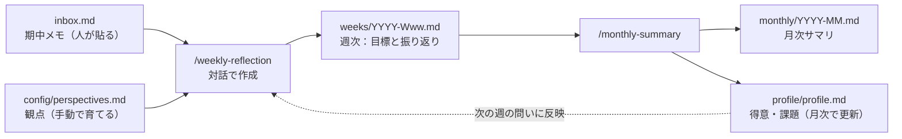

# reflection_kit

週の目標と振り返りを、Claude Code と対話しながら回すための共有キット。
「書くのが面倒」「量が多くて整理できない」を解消するために作った。

> 顧客名・個人名などの機密は書かない（略称・案件コードで書く）。詳しくは末尾の「運用ルール」。

---

## 課題と仕組みの対応

| 課題 | 仕組み |
|------|--------|
| 毎回書くのが面倒 | `weekly-reflection` スキル：質問に答えるだけで書ける |
| 量が多くて整理できない | 週単位のファイル → 月次で `monthly-summary` が要約 |
| 業務が多様化して観点がぶれる | `config/perspectives.md` を毎回読み込ませて観点を固定 |

## データフロー



---

## 使い方

前提：Claude Code をこのディレクトリで起動する。

### 期中：メモを貼る
感じたこと・言われたこと（フィードバック）を、`inbox.md` に1行ずつ貼る。
```
- 2026-09-30 #fb 上司: 図があるとレビューが早い
- 2026-10-01 #詰まり 変数管理票のルールが人によって違う
```
タグは任意（`#気づき` `#工夫` `#詰まり` `#うまくいった` `#fb`）。`#fb` は「他者の声」に転記される。

### 週初：目標を立てる
```
/weekly-reflection 目標
```
先週の「来週への引き継ぎ」を踏まえて、今週の目標を、ビジネス面とテクニカル面の2つの面で対話しながら決める。案件・TODO は概要レベルで、目標の中に書く。

### 週末：振り返る
```
/weekly-reflection 振り返り
```
週初に立てた目標が、そのまま質問になる。目標ごとに「結果・分かったこと・次の一手」の3点を聞かれる（`inbox.md` のメモを参照。チャットに直接貼ってもよい）。
記録の要約に「OK」と答えると `weeks/YYYY-Www.md` が更新され、取り込んだメモは inbox.md から消える。

### 月末：まとめる
```
/monthly-summary
```
その月の週次ファイルから `monthly/YYYY-MM.md` を作り、`profile/profile.md`（得意・課題）を更新する。

---

## ディレクトリ構成

```
reflection_kit/
├── README.md
├── CLAUDE.md                    # Claude Code への共通ルール
├── .claude/skills/
│   ├── weekly-reflection/SKILL.md
│   └── monthly-summary/SKILL.md
├── inbox.md                     # 期中メモ（人が貼る。取り込み後に消える）
├── config/perspectives.md       # 振り返りの観点（自分用に編集する）
├── weeks/                       # 週次ログ（_template.md を元に生成）
├── monthly/                     # 月次サマリ
├── profile/profile.md           # 得意・課題（月次更新、根拠つき）
└── examples/                    # ダミーデータのサンプル
```

## はじめ方（他の人が使う場合）

1. このディレクトリをコピー（またはフォークして private リポジトリにする）
2. `config/perspectives.md` を自分の業務に合わせて編集
3. `profile/profile.md` は空のままでよい（月次で育つ）
4. `/weekly-reflection 目標` から開始

---

## 運用ルール

- **機密**：顧客名・個人名・数値は書かない。略称・案件コードにする。リポジトリは必ず private。
- **事実と解釈を分ける**：スキルは Facts / Interpretation に分けて記録する（事実に根拠のない断定は書かせない）。
- **AI は入力に依存する**：AI の要約は自分が入れた内容の範囲を出ない。1on1・顧客・チームからのフィードバックを「他者からの声」欄に入れて偏りを補正する。
- **確定は人**：AI は書き込む前に要約を見せる。「OK」の返事で確定する。昇格（得意・課題への反映）も同様。
- **人との対話は置き換えない**：1on1・メンター等の対話が主、これは記録と整理の補助。

## 今後（未実装）

- 議事録の要約を自分の言葉で書き直す（社内配布後）
